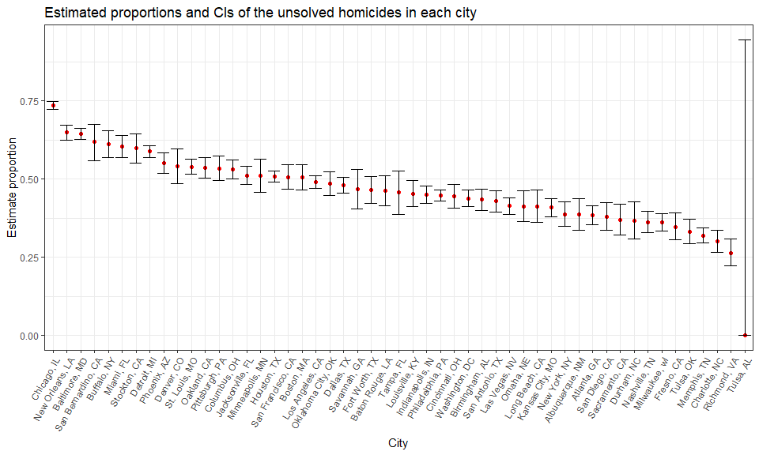

p8105\_hw5\_jy2944
================
Jie Yu
11/6/2018

-   [Problem 1](#problem-1)
    -   [Import and tidy data](#import-and-tidy-data)
    -   [Spaghetti plot](#spaghetti-plot)
-   [Problem 2](#problem-2)
    -   [Import and describe the raw data](#import-and-describe-the-raw-data)
    -   [Summarize number of cases within cities](#summarize-number-of-cases-within-cities)
    -   [Proportion test](#proportion-test)
    -   [Plot showing estimated proportions and CIs](#plot-showing-estimated-proportions-and-cis)

Problem 1
=========

The problem focuses on a longitudinal study that included an experimental arm and a control arm.

### Import and tidy data

We use `purrr::map` to read the data from each csv and combine them into one dataset.

After tidying, each row in the resulting dataset represents the information (arm assignment, id, observation value) for each subject in each week (8 weeks in total).

``` r
# Start with a dataframe containing all file names: `list.files()`
study_df = tibble(file_names = list.files(path = "./data/problem1_data")) %>% 
  # Use `map()` to iterate over file names and read in data for each subject, and save the results in a new variable `data`
  mutate(data = map(.x = str_c("./data/problem1_data/", file_names), 
                    ~ read.csv(.x))) %>% 
  unnest() %>%
  # Begin Tidy
  janitor::clean_names() %>% 
  # remove str ".csv" in variable `file_names`
  mutate(file_names = str_replace(file_names, ".csv", "")) %>% 
  # manipulate file names to include study arm and subject ID
  separate(file_names, into = c("arm", "subject_id"), sep = "_") %>% 
  # gather weekly observations
  gather(key = "week", value = "observation_value", week_1:week_8) %>% 
  mutate(
    # remove str "week_" in variable `week`
    week = str_replace(week, "week_", ""),
    subject_id = factor(subject_id),
    week = as.integer(week),
    arm = factor(arm)
  )
```

### Spaghetti plot

Next we make a spaghetti plot to show observations on each subject over time.

``` r
study_df %>% 
  mutate(arm = recode(arm, "con" = "control", "exp" = "experimental")) %>%
  group_by(arm, subject_id) %>% 
  ggplot(aes(x = week, y = observation_value , color = arm, type = subject_id)) + 
  geom_point() +
  geom_line() +
  labs(
    title = "Observations on each subject over time by control and experimental group",
    x = "Week",
    y = "Observation value"
  ) 
```


The experimental group appears to have an upward trend in observation value over weeks, while the control group appears to have a relatively steady or slight downward trend in observation value over weeks. In the overall aspect, the participants in the experimental group tend to have higher observation value than those in the control group.

Problem 2
=========

### Import and describe the raw data

``` r
# Download the dataset from a Github repo: the file is too big to show on Github
homicide_data = GET("https://raw.githubusercontent.com/washingtonpost/data-homicides/master/homicide-data.csv") %>% 
  content("raw") %>%
  read_csv()
```

This raw data is gathered by the *Washington Post*, which records homicide cases in large U.S cities. The dataset is consisted of 52179 observations and 12 variables. The variables contain information related to the reported date of each case, personal information of each victim (name, race, age, sex), information of the incident site (city, state, latitude, longitude), and the status of each case (`disposition`).

### Summarize number of cases within cities

Then, We create a new variable `city_state` and summarize within cities to obtain the total number of homicide cases and number of unsolved homicide cases.

``` r
homicide_summary = homicide_data %>% 
  # create a `city_state` variable (e.g. “Baltimore, MD”) 
  mutate(city_state = str_c(city, ", ", state)) %>%
  group_by(city_state) %>% 
  summarise(
    # summarize total number of homicides
    total_cases = n(),
    # summarize number of unsolved homicides
    unsolved_cases = sum(disposition %in% c("Closed without arrest", "Open/No arrest"))
    )

head(homicide_summary, 10)
## # A tibble: 10 x 3
##    city_state      total_cases unsolved_cases
##    <chr>                 <int>          <int>
##  1 Albuquerque, NM         378            146
##  2 Atlanta, GA             973            373
##  3 Baltimore, MD          2827           1825
##  4 Baton Rouge, LA         424            196
##  5 Birmingham, AL          800            347
##  6 Boston, MA              614            310
##  7 Buffalo, NY             521            319
##  8 Charlotte, NC           687            206
##  9 Chicago, IL            5535           4073
## 10 Cincinnati, OH          694            309
```

### Proportion test

For the city of Baltimore, MD, we use the `prop.test` function to estimate the proportion of homicides that are unsolved. At the end, we can get the estimated proportion and confidence intervals of unsolved homicide cases in Baltimore.

``` r
# filter the city "Baltimore, MD"
baltimore = homicide_summary %>% 
  filter(city_state == "Baltimore, MD")

# use `prop.test` to estimate the proportion of homicides that are unsolved
# save the output of prop.test as an R object
baltimore_prop = prop.test(baltimore$unsolved_cases, baltimore$total_cases)


baltimore_prop %>% 
  # turn a model object into a tidy tibble
  broom::tidy() %>% 
  # pull the estimated proportion and CI from the resulting tidy dataframe
  select(estimate, conf.low, conf.high) %>% 
  knitr::kable(digits = 3)
```

|  estimate|  conf.low|  conf.high|
|---------:|---------:|----------:|
|     0.646|     0.628|      0.663|

Now we run `prop.test` for each city in our dataset, and get the estimated proportion and confidence interval of unsolved homicide cases for each city.

``` r
# Establish a function for prop_test, turn the model object into a tidy tibble, and pull the estimated proportion and CI
prop_test = function(x, n){
  prop.test(x, n) %>% 
    broom::tidy() %>% 
    select(estimate, conf.low, conf.high)
}

# run the prop_test function for all cities
all_cities_prop = homicide_summary %>% 
  # map2(): use it when your function has 2 arguments
  mutate(prop_city = map2(.x = unsolved_cases, .y = total_cases, 
                          ~prop_test(.x, .y))) %>% 
  unnest() %>% 
  select(-total_cases, -unsolved_cases)

head(all_cities_prop, 10)
## # A tibble: 10 x 4
##    city_state      estimate conf.low conf.high
##    <chr>              <dbl>    <dbl>     <dbl>
##  1 Albuquerque, NM    0.386    0.337     0.438
##  2 Atlanta, GA        0.383    0.353     0.415
##  3 Baltimore, MD      0.646    0.628     0.663
##  4 Baton Rouge, LA    0.462    0.414     0.511
##  5 Birmingham, AL     0.434    0.399     0.469
##  6 Boston, MA         0.505    0.465     0.545
##  7 Buffalo, NY        0.612    0.569     0.654
##  8 Charlotte, NC      0.300    0.266     0.336
##  9 Chicago, IL        0.736    0.724     0.747
## 10 Cincinnati, OH     0.445    0.408     0.483
```

### Plot showing estimated proportions and CIs

``` r
all_cities_prop %>% 
  # organize cities according to the proportion of unsolved homicides (in a descending order)
  mutate(city_state = forcats::fct_reorder(city_state, estimate, .desc = TRUE)) %>% 
  # make the plot
  ggplot(aes(x = city_state, y = estimate)) +
  # points represent the proportions for each city
  geom_point() +
  # geom_errorbar(): add error bars based on the upper and lower limits
  geom_errorbar(aes(x = city_state, ymin = conf.low, ymax = conf.high)) +
  labs(
    title = "Estimated proportions and CIs of the unsolved homicides in each city", 
    x = "City", 
    y = "Estimate proportion") +
  theme(axis.text.x = element_text(angle = 60, hjust = 1))
```


