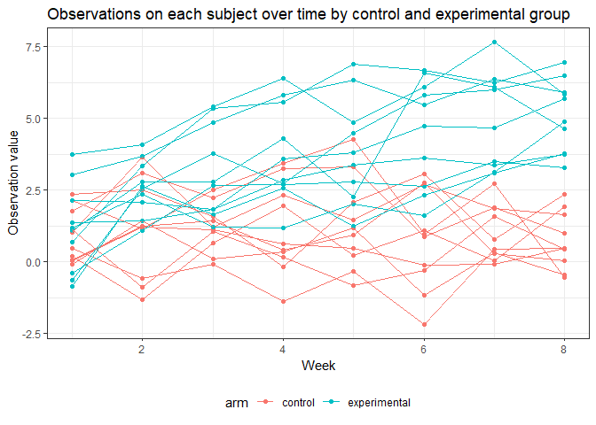

p8105\_hw5\_jy2944
================
Jie Yu
11/6/2018

-   [Problem 1](#problem-1)
    -   [Import and tidy data](#import-and-tidy-data)
    -   [Spaghetti plot](#spaghetti-plot)
-   [Problem 2](#problem-2)
    -   [Import data](#import-data)
    -   [Description of raw data](#description-of-raw-data)
    -   [Summary number of cases within cities](#summary-number-of-cases-within-cities)

Problem 1
=========

### Import and tidy data

``` r
# Start with a dataframe containing all file names: `list.files()`
study_df = tibble(file_names = list.files(path = "./data/problem1_data")) %>% 
  # Use `map()` to iterate over file names and read in data for each subject, and save the results in a new variable `data`
  mutate(data = map(.x = str_c("./data/problem1_data/", file_names), 
                    ~ read.csv(.x))) %>% 
  unnest() %>%
  # Begin Tidy
  janitor::clean_names() %>% 
  # remove str ".csv" in variable `file_names`
  mutate(file_names = str_replace(file_names, ".csv", "")) %>% 
  # manipulate file names to include study arm and subject ID
  separate(file_names, into = c("group", "subject_id"), sep = "_") %>% 
  # gather weekly observations
  gather(key = "week", value = "subject_data", week_1:week_8) %>% 
  mutate(
    # remove str "week_" in variable `week`
    week = str_replace(week, "week_", ""),
    subject_id = factor(subject_id),
    week = as.integer(week),
    group = factor(group)
  )
```

### Spaghetti plot

``` r
study_df %>% 
  mutate(group = recode(group, "con" = "control", "exp" = "experimental")) %>%
  ggplot(aes(x = week, y = subject_data, color = subject_id, group = subject_id)) +
  geom_point(alpha = 0.5) +
  geom_line() +
  facet_grid(. ~group) +
  labs(
    title = "Observations on each subject over time by control and experimental group",
    x = "Week",
    y = "Observation value",
    color = "Subject ID"
  ) 
```



Comments:

Problem 2
=========

### Import data

``` r
# Download the dataset from a Github repo: the file is too big to show on Github
homicide_data = GET("https://raw.githubusercontent.com/washingtonpost/data-homicides/master/homicide-data.csv") %>% 
  content("raw") %>%
  read_csv()
```

### Description of raw data

This raw data is gathered by the *Washington Post*, which records homicide cases in large U.S cities. The dataset is consisted of 52179 observations and 12 variables. The variables contain information related to the reported date of each case, personal information of each victim (name, race, age, sex), information of the incident site (city, state, latitude, longitude), and the status of each case (`disposition`).

### Summary number of cases within cities

Then, We create a new variable `city_state` and summarize within cities to obtain the total number of homicide cases and number of unsolved homicide cases.

``` r
homicide_summary = homicide_data %>% 
  # create a `city_state` variable (e.g. “Baltimore, MD”) 
  mutate(city_state = str_c(city, ", ", state)) %>%
  group_by(city_state) %>% 
  summarise(
    # summarize total number of homicides
    total_cases = n(),
    # summarize number of unsolved homicides
    unsolved_cases = sum(disposition %in% c("Closed without arrest", "Open/No arrest"))
    )

head(homicide_summary, 10)
## # A tibble: 10 x 3
##    city_state      total_cases unsolved_cases
##    <chr>                 <int>          <int>
##  1 Albuquerque, NM         378            146
##  2 Atlanta, GA             973            373
##  3 Baltimore, MD          2827           1825
##  4 Baton Rouge, LA         424            196
##  5 Birmingham, AL          800            347
##  6 Boston, MA              614            310
##  7 Buffalo, NY             521            319
##  8 Charlotte, NC           687            206
##  9 Chicago, IL            5535           4073
## 10 Cincinnati, OH          694            309
```
